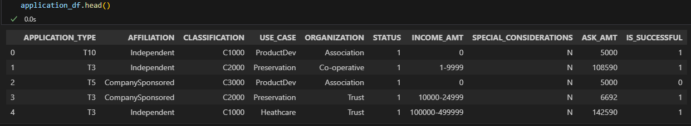

## Neural Network Model Report

# Overview
The nonprofit foundation Alphabet Soup wants a tool that can help it select the applicants for funding with the best chance of success in their ventures. The purpose of this analysis is to use machine learning and neural networks, and the features in the provided dataset to create a binary classifier that can predict whether applicants will be successful if funded by Alphabet Soup.

# Results

Data Preprocessing
- The target for this model is the variabe "IS_SUCCESSFUL".
- The features for this model are the variables "APPLICATION_TYPE" and "CLASSIFICATION"
- The variables should be removed from the input data because they are neither targets nor features were "EIN" and "NAME"

Compiling, Training, and Evaluating the Model

- In the original model (deep_learning_challenge.ipynb), there are 2 layers, 8 neurons in the first layer and 5 neurons in the second layer, and 2 activation functions (relu and sigmoid). These were used on a trial and error basis.
- This model was not able to achieve the target model performance, with an accuracy of 73.8% and loss of 54.7%.
What steps did you take in your attempts to increase model performance?
- To increase model performance, the first attempt taken was to bin by "INCOME_AMT".
- The second attempt was to increase layers and change the activation functions.
- The third attempt was to decrease the epochs from 100 to 10.

# Summary
Overall, both the original and optimized models had approximately 73% accuracy. To increase accuracy, choosing variables with better correlation might impact the model's accuracy and prediction outcomes. Adding more bins and filtering data to be more specific and using different activation functions might also contribute towards improving the accuracy of the model.
